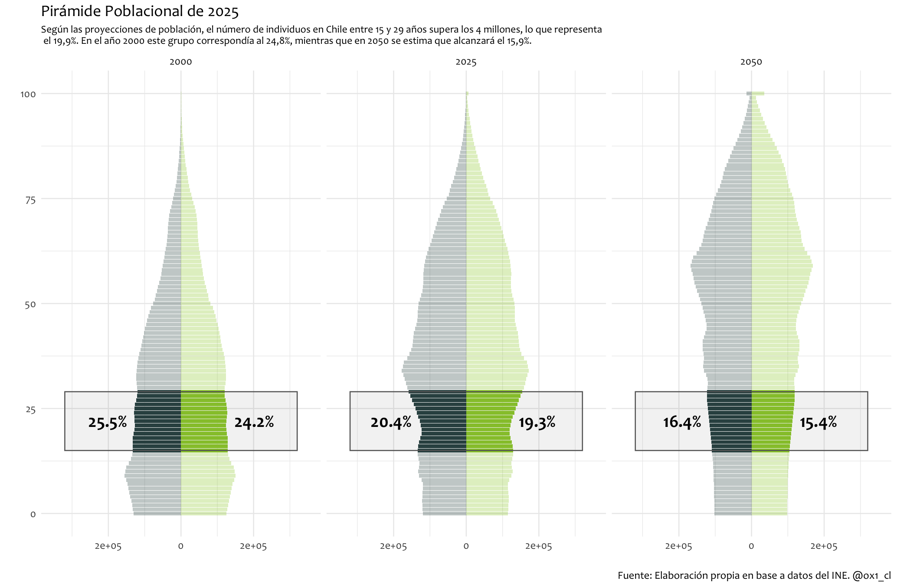

# Demographic Pyramid of Chile (2000–2050)

This repository contains R code to build a **population pyramid** using Chilean demographic data provided by the [Instituto Nacional de Estadísticas (INE)](https://www.ine.gob.cl/estadisticas/sociales/demografia-y-vitales/proyecciones-de-poblacion).  
The graph highlights the structure of the Chilean population by age and sex, with a special focus on the youth segment (15–29 years old), comparing its evolution across three key years: **2000, 2025, and 2050**.

---

## 📊 About the Data
The dataset comes from INE’s official projections:  
**“Estimaciones y proyecciones de población 1992–2050 (base 2017)”**.  
It includes yearly estimates of population by **age**, **sex**, and **total population**.

In this project, the dataset is filtered and transformed to:
- Clean variable names and values.
- Convert age and year into numeric formats.
- Differentiate males and females.
- Calculate the **proportion of young people (15–29 years)** within the total population.

---

## 🧑‍💻 The R Script
The script included in this repository (`pyramid_chile.R`) performs the following steps:
1. **Load and clean the data**: removes totals, handles missing values, and converts text into numeric variables.
2. **Reshape the dataset**: makes it tidy and ready for visualization using `reshape2`.
3. **Calculate youth share**: computes the percentage of the population between 15–29 years old by sex and year.
4. **Create the pyramid plot** with `ggplot2`.

---

## 📈 Example Output

After running the script, you will obtain a demographic pyramid similar to the following:



> **Title**: *Pirámide Poblacional de Chile (2000–2050)*  
> **Subtitle**:  
> In 2000, young people (15–29) represented **24.8%** of the population.  
> In 2025, they are projected to represent **19.9%**.  
> By 2050, the proportion is expected to fall to **15.9%**.

---

## ▶️ How to Run

```bash
# 1. Clone this repository
git clone https://github.com/yourusername/chile-demographic-pyramid.git

# 2. Open the R script (pyramid_chile.R) in R or RStudio

# 3. Install required packages if not already installed
Rscript -e "install.packages(c('reshape2','ggplot2'))"

# 4. Place the INE dataset in the same directory as the script:
#    ine_estimaciones-y-proyecciones-de-población-1992-2050_base-2017_base-de-datos.csv

# 5. Run the script to generate the figure
Rscript pyramid_chile.R
